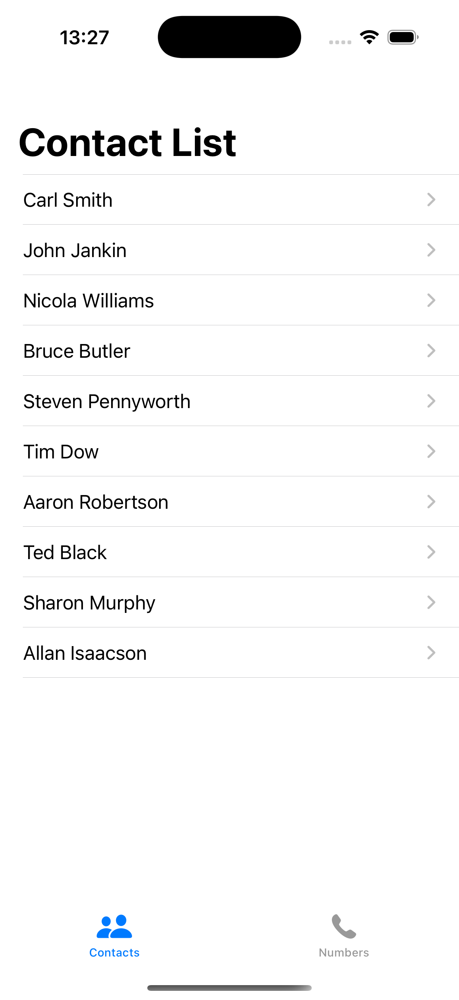
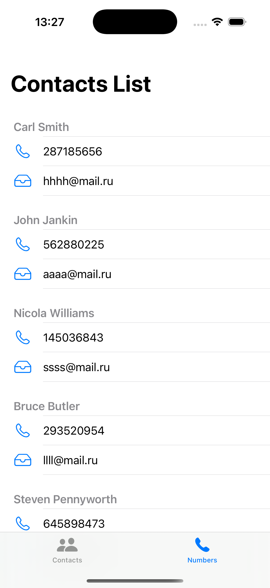

# ContantList

Приложение на **SwiftUI**, генерирует список контактов и показывает их в двух вкладках: простой список и секции с деталями.

---

## Стек

- **Язык:** Swift 5+  
- **UI:** SwiftUI + UIKit

---

## Функциональность

- Таб-бар с двумя экранами:
  - **Contact List:** список `Person` с переходом на экран деталей.
  - **Numbers:** секционный список. В секции — телефон и email контакта.
- Экран **деталей контакта** с иконкой-аватаром, телефоном и email.
- Навигация на базе `NavigationStack`.
- Мок данные генерируются из `DataStore`.

---

## Архитектура и данные

- **Модель**: `Person: Identifiable` с полями `id`, `name`, `surname`, `email`, `phoneNumber` и вычисляемым `fullName`.
- **Источник данных**: `DataStore.shared` хранит массивы имён, фамилий, email и телефонов и собирает список контактов.
- **Слои проекта**:
  - `Models/` — модель `Person`
  - `Views/` — `ContentView`, `ContactListView`, `SectionsView`, `PersonView`
  - `Services/` — `DataStore`
  - `Assets.xcassets/` — ресурсы (AppIcon, AccentColor)

---

## Скриншоты

| Список | Секции | Детали |
|---|---|---|
|  |  |  |

---

## Технические детали

- `ContentView` — корневой `TabView` с двумя вкладками.
- `ContactListView` — `List` с `NavigationLink` к `PersonView`.
- `SectionsView` — `List` с `Section`, в шапке — `fullName`.
- `PersonView` — отображение телефона и email через `Label`.
- `LaunchScreen.storyboard` используется только для заставки. Основной UI — **SwiftUI**.
- В проекте нет сторонних библиотек и сетевого слоя.

---

## Структура

```
ContantList/
 ├─ ContantList.xcodeproj
 └─ ContantList/
    ├─ AppDelegate.swift
    ├─ SceneDelegate.swift
    ├─ Info.plist
    ├─ Assets.xcassets/
    ├─ Base.lproj/
    │   └─ LaunchScreen.storyboard
    ├─ Models/
    │   └─ Person.swift
    ├─ Services/
    │   └─ DataStore.swift
    └─ Views/
        ├─ ContentView.swift
        ├─ ContactListView.swift
        ├─ SectionsView.swift
        └─ PersonView.swift
```
